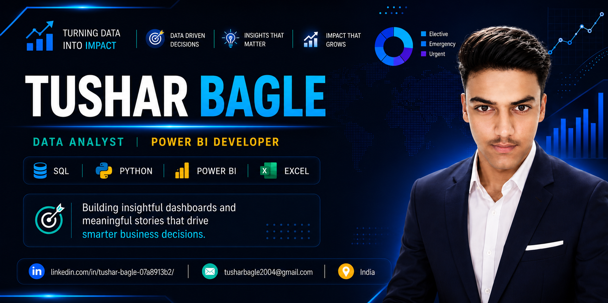

<!-- ===================== PROFILE BANNER ===================== -->

<p align="center">
  
</p>

<h1 align="center">Hi 👋, I'm Tushar Bagle</h1>

<h3 align="center">
  Data Analyst • Power BI Developer • SQL • Python
</h3>

<p align="center">
  <strong>Building dashboards that turn data into business insights.</strong>
</p>

<p align="center">
  <a href="https://github.com/TusharBagle">
    
  </a>
  <a href="https://www.linkedin.com/in/tushar-bagle-07a8913b2/">
    
  </a>
  <a href="mailto:tusharbagle2007@gmail.com">
    
  </a>
  <a href="https://www.kaggle.com/tusharbagle">
    
  </a>
</p>

---

# 👨‍💻 About Me

I'm **Tushar Bagle**, a Data Analyst from India passionate about transforming raw data into meaningful business insights.

🎓 **B.Tech in Computer Science & Engineering**
🏫 **Vidhyadeep University**
📅 **2025 – 2029**

### 🔹 My Focus

* 📊 Power BI Dashboard Development
* 🗄️ SQL & Database Analysis
* 🐍 Python for Data Analysis
* 📈 Excel Data Analysis
* 📉 Data Visualization
* 🧹 Data Cleaning & Transformation
* 📐 DAX & Data Modeling
* 💡 Business Intelligence
* 🚀 Advanced Data Analytics

### 🎯 My Goal

To build **impactful dashboards and data solutions** that solve real-world business problems and help organizations make data-driven decisions.

---

# 🛠️ Tech Stack

### 📊 Data Analytics & Visualization

<p>
  
  
  
</p>

### 🐍 Python

<p>
  
  
  
</p>

### 🔧 Tools

<p>
  
  
  
</p>

---

# 📊 My Data Analytics Workflow

```text
                RAW DATA
                   │
                   ▼
          ┌─────────────────┐
          │ Data Cleaning   │
          └────────┬────────┘
                   │
                   ▼
          ┌─────────────────┐
          │ Data Transform  │
          └────────┬────────┘
                   │
                   ▼
       ┌─────────────────────────┐
       │ Excel • SQL • Python    │
       └────────────┬────────────┘
                    │
                    ▼
          ┌─────────────────┐
          │ Data Modeling   │
          └────────┬────────┘
                   │
                   ▼
          ┌─────────────────┐
          │    Power BI     │
          │    Dashboard    │
          └────────┬────────┘
                   │
                   ▼
          ┌─────────────────┐
          │ Business        │
          │ Insights        │
          └─────────────────┘
```

---

# 🚀 Featured Projects

## ✈️ Airline Dashboard — Power BI

Interactive Power BI dashboard designed to analyze airline data and generate meaningful business insights.

**Skills:** Power BI • DAX • Data Modeling • Data Visualization

🔗 **Repository:**
https://github.com/TusharBagle/Airline-Dashboard-Power-BI

---

## 🏥 Healthcare Dashboard — Power BI

Healthcare analytics dashboard focused on KPIs, trends and performance analysis.

**Skills:** Power BI • DAX • Data Modeling • Visualization

🔗 **Repository:**
https://github.com/TusharBagle/Healthcare-Dashboard-Power-BI

---

## 🛒 Sales Dashboard

Interactive sales analytics project focused on revenue, sales trends, product performance and KPIs.

**Skills:** Power BI • SQL • Excel • Data Analysis

🔗 **Repository:**
https://github.com/TusharBagle/Sales-Dashboard

---

## 🐍 Python Data Analysis

Data analysis project involving data cleaning, exploratory analysis, visualization and automation using Python.

**Skills:** Python • Pandas • Matplotlib • EDA • Data Cleaning

---

# 📂 Practical Data Analysis Projects

I also work on complete end-to-end practical projects using:

```text
Excel
  ↓
SQL
  ↓
Python
  ↓
Power BI
  ↓
GitHub
```

These projects help me practice the complete workflow from **raw data to business insights**.

---

# 🖼️ Dashboard Gallery

### 📊 Power BI Projects

| Project                 | Main Focus               |
| ----------------------- | ------------------------ |
| ✈️ Airline Dashboard    | Airline Analytics        |
| 🏥 Healthcare Dashboard | Healthcare KPIs          |
| 🛒 Sales Dashboard      | Sales & Revenue          |
| 👥 Customer Analytics   | Customer Behavior        |
| 🏦 Banking Analytics    | Banking & Financial Data |

---

# 📜 Certifications

### 🟡 Microsoft Power BI

Power BI learning and dashboard development.

### 🐍 Python — Coursera

Python learning path / certification.

### 📊 Microsoft 365 Excel Essential — Udemy

Excel skills including formulas, analysis and productivity features.

### 🗄️ SQL — HackerRank

**Coming Soon**

---

# 📈 GitHub Stats

<p align="center">
  
  
</p>

---

# 📊 Tushar Bagle's Contribution Graph

<p align="center">
  
</p>

---

# 🐍 Contribution Snake

<p align="center">
  
</p>

---

# 🎯 Currently Learning

```text
📊 Advanced Data Analytics
🧮 Advanced SQL
📐 Advanced DAX
🐍 Advanced Python
📈 Business Intelligence
🤖 Machine Learning
```

---

# 💡 My Approach to Data

> **"Data becomes valuable when it helps people make better decisions."**

I focus on turning complex datasets into:

**Data → Insights → Decisions → Business Impact**

---

# 📄 Resume

<p align="center">

<a href="assets/Tushar_Bagle_Data_Analyst_Resume.pdf">
  
</a>

</p>

---

# 📫 Connect With Me

<p align="center">

<a href="https://github.com/TusharBagle">

</a>

<a href="https://www.linkedin.com/in/tushar-bagle-07a8913b2/">

</a>

<a href="mailto:tusharbagle2007@gmail.com">

</a>

<a href="https://www.kaggle.com/tusharbagle">

</a>

</p>

---

# ⭐ Thanks for Visiting My Profile!

<p align="center">

**If you find my projects useful, consider giving them a ⭐**

**Let's connect, collaborate and turn data into insights.**

</p>

---

<p align="center">
  
</p>
